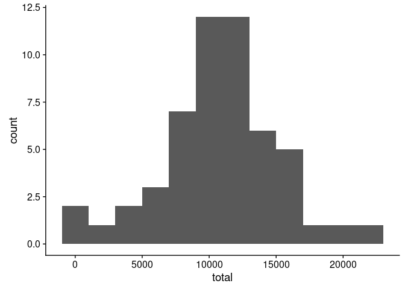
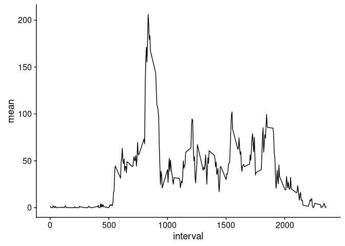
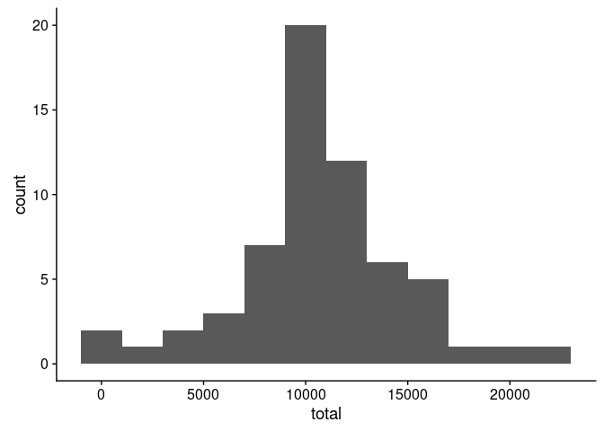
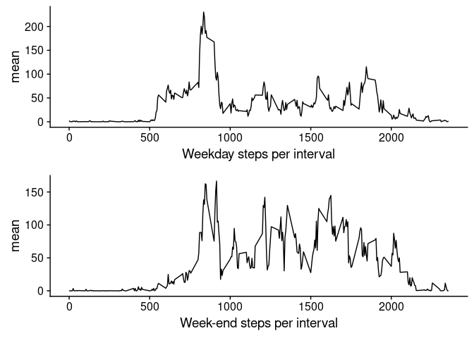

## Loading and preprocessing the data

We need to load libraries that will be used in this project and to get to the correct place in the filesystem. 

* `tidyverse` loads (almost) everything for data processing and visualization
* `lubridate` provides convenient functions for date manipulation
* `sqldf` allows to use *SQL* on dataframes (I used to work with it and found it logical and likable, no other reason)


```r
library(tidyverse)
```

```
## ── Attaching packages ───────────────────────────────────────────────────────────────────────────────── tidyverse 1.2.1 ──
```

```
## ✔ ggplot2 2.2.1     ✔ purrr   0.2.5
## ✔ tibble  1.4.2     ✔ dplyr   0.7.5
## ✔ tidyr   0.8.1     ✔ stringr 1.3.1
## ✔ readr   1.1.1     ✔ forcats 0.3.0
```

```
## ── Conflicts ──────────────────────────────────────────────────────────────────────────────────── tidyverse_conflicts() ──
## ✖ dplyr::filter() masks stats::filter()
## ✖ dplyr::lag()    masks stats::lag()
```

```r
library(sqldf)
```

```
## Loading required package: gsubfn
```

```
## Loading required package: proto
```

```
## Loading required package: RSQLite
```

```r
library(lubridate)
```

```
## 
## Attaching package: 'lubridate'
```

```
## The following object is masked from 'package:base':
## 
##     date
```

```r
library(cowplot)
```

```
## 
## Attaching package: 'cowplot'
```

```
## The following object is masked from 'package:ggplot2':
## 
##     ggsave
```

```r
setwd("~/src/coursera/RepData_PeerAssessment1/")
data <- read.csv("activity.csv")

# want to aggregate by date (i.e. day)
# rounding because many decimals not relevant to number of steps


sumdate <- data %>% 
  group_by(date) %>% 
  summarise(mean = round(mean(steps),2), median = round(median(steps[steps>0]),0),total = sum(steps))
```

## What is mean total number of steps taken per day?

We will make a histogram first showing the frequency distribution of number of steps taken in a day.


```r
ggplot(sumdate,aes(x=total)) + geom_histogram(binwidth = 2000)
```

```
## Warning: Removed 8 rows containing non-finite values (stat_bin).
```



```r
meanTOT1 <- round(mean(sumdate$total,na.rm = T),0)
medTOT1 <- median(sumdate$total,na.rm = T)
```

## What is the average daily activity pattern?

The histogram shows the most frequent total step counts per day.


```r
sumints <- data %>%
  group_by(interval) %>%
  summarise(mean = round(mean(steps,na.rm = T),2), median = round(median(steps[steps>0],na.rm = T),0)) %>%
  mutate(rndmean = round(mean,0))

ggplot(sumints,aes(x=interval,y=mean)) + geom_line()
```



```r
maxStepInt <- sumints$interval[sumints$mean == max(sumints$mean)]
```

Note that the interval where maximum number of steps is taken across all days is 835 or 08:35 in the morning.


## Imputing missing values

The data would be different if the observations would have been made every day. We will now impute missning values (_NA_). Imputation strategy is very simple - we will take rounded average number of steps per interval and substitute that value for each interval that is missing values.

We use SQL for updating dataframe data2 - a copy of the original dataset.

We can see that the histogram of step distribution is narrower and taller.


```r
data2 <- data
wkd <- c("Monday","Tuesday","Wednesday","Thursday","Friday")

data2 <- sqldf(c("update data2 
	set steps = (select rndmean
				from sumints
				where interval = data2.interval)
	where exists (select rndmean
					from sumints
					where interval = data2.interval
					and
					data2.steps is null)",
	"select * from data2"))
```

```
## Warning in result_fetch(res@ptr, n = n): Don't need to call dbFetch() for
## statements, only for queries
```

```r
# just to check we are doing OK
# sum(is.na(data2$steps))

# group by date and then by interval

sumdate2 <- data2 %>% 
  group_by(date) %>% 
  summarise(mean = round(mean(steps),2), median = round(median(steps[steps>0]),0),total = sum(steps))

sumints2 <- data2 %>%
  group_by(interval) %>%
  summarise(mean = round(mean(steps,na.rm = T),2), median = round(median(steps[steps>0]),0)) %>%
  mutate(rndmean = round(mean,0))

# ggplot(sumints2,aes(x=as.numeric(interval),y=mean)) + geom_line()
ggplot(sumdate2,aes(x=total)) + geom_histogram(binwidth = 2000)
```



```r
# sqldf("select d1.date,d1.total,d2.total from sumdate as d1, sumdate2 as d2 where d1.date=d2.date")
```


## Are there differences in activity patterns between weekdays and weekends?

We can see that on weekdays there are more steps in the morning - presumably when people go to work. On weekends steps are distributed much more evenly.


```r
# add weekday vs weekend column

data2 <- data2 %>% 
  mutate(weekday = if_else(weekdays(ymd(date)) %in% wkd,"weekday","weekend"))

#sumints2 <- sumints2 %>% 
#  mutate(weekday = if_else(weekdays(ymd(date))%in% wkd,"weekday","wekend"))


sumints2WE <- data2 %>%
  filter(weekday == "weekend") %>%
  group_by(interval) %>%
  summarise(mean = round(mean(steps,na.rm = T),2), median = round(median(steps[steps>0]),0)) %>%
  mutate(rndmean = round(mean,0))

sumints2WD <- data2 %>%
  filter(weekday == "weekday") %>%
  group_by(interval) %>%
  summarise(mean = round(mean(steps,na.rm = T),2), median = round(median(steps[steps>0]),0)) %>%
  mutate(rndmean = round(mean,0))

gWD <- ggplot(sumints2WD,aes(x=as.numeric(interval),y=mean)) + geom_line() + xlab("Weekday steps per interval")
gWE <- ggplot(sumints2WE,aes(x=as.numeric(interval),y=mean)) + geom_line() + xlab("Week-end steps per interval")

plot_grid(gWD,gWE, align="v", nrow=2)
```


